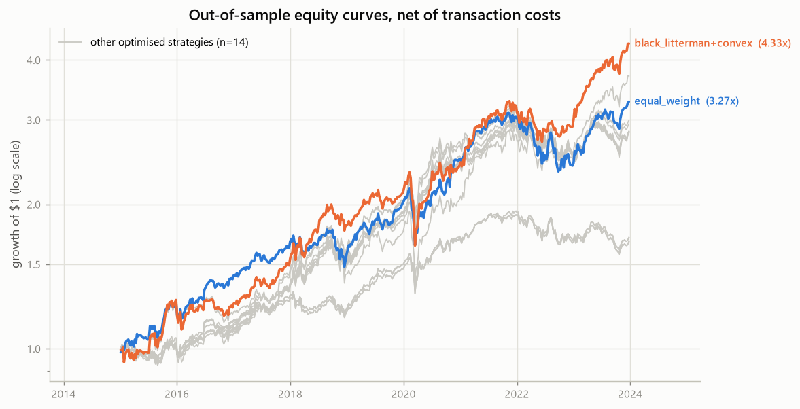
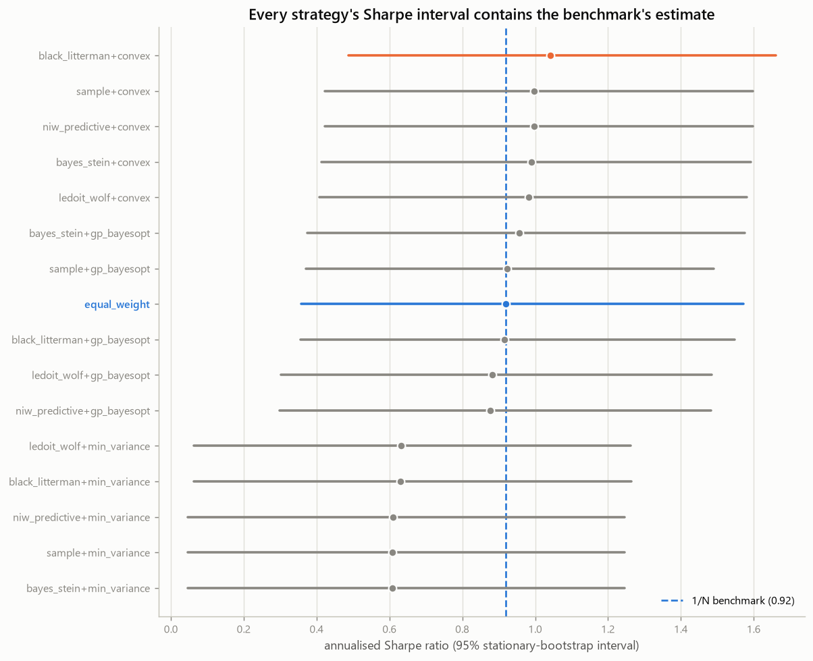

# The Estimator or the Optimiser?

**A walk-forward decomposition of Bayesian methods in mean–variance portfolio choice.**

[](https://github.com/NekoTensor/Bayesian-portfolio-optimization/actions/workflows/tests.yml)

Mean–variance portfolio selection needs two estimated inputs — a vector of expected
returns `μ` and a covariance matrix `Σ` — and then an optimiser to turn them into
weights. Papers comparing portfolio methods routinely change the estimator, the
optimiser, and the constraint set all at once, then credit the difference to
whichever one the title names.

This project separates them:

> **Holding the objective and the feasible set fixed, how much out-of-sample
> performance comes from the estimator, and how much from the optimiser?**

Five belief-formation rules × three allocators, evaluated walk-forward against the
1/N benchmark, with significance testing.

|  | minimum variance | convex (SLSQP) | GP Bayesian opt |
|---|---|---|---|
| **Sample moments** | ✓ | ✓ | ✓ |
| **Ledoit–Wolf shrinkage** | ✓ | ✓ | ✓ |
| **Bayes–Stein** | ✓ | ✓ | ✓ |
| **NIW posterior predictive** | ✓ | ✓ | ✓ |
| **Black–Litterman** | ✓ | ✓ | ✓ |

Plus **1/N** as the benchmark — the baseline [DeMiguel, Garlappi & Uppal (2009)](https://doi.org/10.1093/rfs/hhm075)
showed is hard to beat, and the one most portfolio studies quietly omit.

---

<!-- RESULTS:START -->
<!-- Generated by experiments/make_report_tables.py -- do not edit by hand. -->

## Results

469 out-of-sample weeks (2015-01-04 → 2023-12-24),
7 assets, 156-week rolling training window,
rebalanced every 13 weeks, 10 bps proportional cost,
40% position cap. Every weight is chosen using only data strictly
preceding the period it is evaluated on.

| Strategy | Sharpe | 95% CI | Δ vs 1/N | *p* | Ann. return | Max DD | Turnover |
|---|---|---|---|---|---|---|---|
| Black–Litterman + Convex | 1.041 | [0.49, 1.66] | +0.123 | 0.52 | 17.72% | -29.70% | 0.66 |
| Sample + Convex | 0.997 | [0.42, 1.60] | +0.078 | 0.70 | 12.35% | -17.71% | 0.28 |
| NIW predictive + Convex | 0.996 | [0.42, 1.60] | +0.078 | 0.70 | 12.33% | -17.64% | 0.28 |
| Bayes–Stein + Convex | 0.990 | [0.41, 1.59] | +0.072 | 0.72 | 12.26% | -17.78% | 0.28 |
| Ledoit–Wolf + Convex | 0.982 | [0.41, 1.58] | +0.063 | 0.74 | 12.34% | -18.63% | 0.28 |
| Bayes–Stein + GP BayesOpt | 0.956 | [0.37, 1.58] | +0.038 | 0.84 | 13.10% | -21.01% | 0.37 |
| Sample + GP BayesOpt | 0.923 | [0.37, 1.49] | +0.004 | 0.98 | 12.95% | -16.80% | 0.42 |
| **1/N (benchmark)** | **0.919** | [0.36, 1.57] | — | — | 14.40% | -24.47% | 0.10 |
| Black–Litterman + GP BayesOpt | 0.915 | [0.36, 1.55] | -0.004 | 0.98 | 16.09% | -29.11% | 0.84 |
| Ledoit–Wolf + GP BayesOpt | 0.883 | [0.30, 1.49] | -0.036 | 0.86 | 12.55% | -23.77% | 0.39 |
| NIW predictive + GP BayesOpt | 0.877 | [0.30, 1.48] | -0.041 | 0.84 | 12.54% | -22.64% | 0.42 |
| Ledoit–Wolf + Min-var | 0.632 | [0.06, 1.26] | -0.287 | 0.09 | 6.45% | -17.25% | 0.13 |
| Black–Litterman + Min-var | 0.631 | [0.06, 1.26] | -0.288 | 0.09 | 6.44% | -17.29% | 0.13 |
| NIW predictive + Min-var | 0.610 | [0.05, 1.25] | -0.309 | 0.08 | 6.23% | -17.60% | 0.15 |
| Sample + Min-var | 0.608 | [0.05, 1.25] | -0.311 | 0.08 | 6.21% | -17.74% | 0.15 |
| Bayes–Stein + Min-var | 0.608 | [0.05, 1.25] | -0.311 | 0.08 | 6.21% | -17.74% | 0.15 |

*p* is the Ledoit–Wolf (2008) test for a difference in Sharpe ratios against 1/N,
robust to the autocorrelation and fat tails that invalidate the textbook
Jobson–Korkie statistic. Intervals are stationary-bootstrap percentiles.

### What the experiment found

**1. Bayesian optimisation lost to convex optimisation — on every estimator.**
Given the identical objective, the identical feasible set, and a search budget that
*favoured* it (60 GP evaluations against
15 SLSQP restarts), the Gaussian-process
allocator finished behind SLSQP in 5 of 5 paired
comparisons — mean Sharpe 0.911 against 1.001, a gap of
0.090. It also turned over
1.4×
as much portfolio per rebalance to get there.

This is the reverse of what the original version of this project reported, and the
reversal is diagnostic rather than surprising. Maximising the Sharpe ratio of a
plug-in `μ`/`Σ` is a *convex* problem that SLSQP solves essentially exactly. A
global black-box search cannot beat an exact solver on its own objective; it can
only fit the training window's noise more aggressively. In-sample that looks like
outperformance. Out-of-sample it is a cost.

**2. Nothing beat 1/N. Not one strategy of 15.**
The best configuration (Black–Litterman + Convex, Sharpe
1.041) sits +0.123
above the benchmark with *p* = 0.52 — it pays for
that edge with -29.7% maximum drawdown against 1/N's
-24.5%, and 6×
the turnover. 0 of 15 configurations beat equal-weighting at
the 5% level. This replicates [DeMiguel, Garlappi & Uppal (2009)](https://doi.org/10.1093/rfs/hhm075)
on an independent sample.

**3. The estimator axis was nearly flat here — and the error bars explain why.**
Across the convex allocators, swapping sample moments for Ledoit–Wolf, Bayes–Stein,
NIW, or Black–Litterman moved the Sharpe ratio by 0.060 in total.
The median 95% interval is 1.19 Sharpe units wide. With
469 weekly observations, *no* difference of the size this
literature typically reports is distinguishable from zero.

That is the finding with teeth, and it indicts the original claim directly: a
"35% Sharpe improvement" is roughly 0.27 of one
confidence-interval width. It was never a result. It was noise that had not been
measured.

Read this as a negative result on a small universe, not a general law: with
7 assets and a 156-week window,
`N/T` is small, which is exactly the regime where shrinkage has least to offer.
The design, not the verdict, is what transfers.

<p align="center">
  
  <br><em>Out-of-sample growth of $1. The spread between methods is smaller than the
  spread between plausible histories of any one of them.</em>
</p>

<p align="center">
  
  <br><em>Every interval contains every other point estimate. Overlap alone does not
  settle it — these series are highly correlated, so the paired difference test is
  what governs. Here it agrees.</em>
</p>

<!-- RESULTS:END -->

---

## Why this repository looks the way it does

An earlier version of this project claimed Bayesian optimisation improved the
Sharpe ratio by 35% and cut drawdown by 34%. **That result was invalid.** Weights
were fitted on the full sample and evaluated on the same sample; the two methods
were given different feasible sets; and the notebook that produced the published
numbers hardcoded its weights rather than calling an optimiser.

[**`docs/postmortem.md`**](docs/postmortem.md) is the full accounting — what the
error was, why it produced a positive result almost automatically, and what I
should have done differently. The original code is preserved under
[`legacy/`](legacy/) so the postmortem can be checked against it.

That history is why the design choices below are non-negotiable in this codebase:

| Guarantee | How it is enforced |
|---|---|
| No look-ahead | `tests/test_backtest.py` corrupts all returns after a cutoff and asserts every weight decided before it is **bitwise** unchanged. |
| Identical feasible sets | One `FeasibleSet` object is passed to every allocator; each returned weight vector is checked against it. |
| Equal search effort | Both optimisers expose `search_budget`, so thoroughness can be equalised rather than confounded with method. |
| Honest multiple testing | The Deflated Sharpe Ratio counts **all** configurations run, including the ones that lost. |
| No transcribed numbers | Every figure in the README and the paper is generated from `results/` — see `experiments/make_report_tables.py`. |

## What is actually Bayesian here

The original project called itself Bayesian because it used `gp_minimize` — a
black-box *optimisation* technique. That is not Bayesian statistics applied to
portfolio construction, and the distinction matters: estimation error in `μ` and
`Σ` is the binding constraint in mean–variance choice, and a Gaussian process over
the weight space does nothing about it.

`portfolio/estimators.py` implements the statistical half properly:

- **Ledoit–Wolf (2004)** — analytically optimal shrinkage of `Σ` toward constant
  correlation. The shrinkage intensity is verified in tests to decay as ~1/T and
  to beat the sample covariance in ≥80% of short-window draws against a known truth.
- **Bayes–Stein (Jorion, 1986)** — shrinks `μ` toward the global minimum-variance
  return, and inflates `Σ` for the parameter uncertainty plug-in methods ignore.
- **Normal-Inverse-Wishart posterior predictive** — a conjugate prior on `(μ, Σ)`;
  the allocator receives a multivariate-*t* predictive distribution, not a point estimate.
- **Black–Litterman (1992)** — equilibrium prior from reverse optimisation, blended
  with a cross-sectional momentum view.

## Repository layout

```
portfolio/          the library
├── data.py           load the committed price panel
├── objectives.py     FeasibleSet, simplex projection, Sharpe objective, turnover
├── estimators.py     training window -> Belief(mu, cov)
├── strategies.py     Belief + FeasibleSet -> weights
├── backtest.py       rolling-origin walk-forward with costs and weight drift
├── stats.py          Sharpe difference tests, bootstrap CIs, Deflated Sharpe
└── stress.py         portfolio-level VaR/CVaR: Gaussian vs Student-t vs bootstrap

experiments/        reproducible entry points -> results/
tests/              property and regression tests, incl. the look-ahead poison test
results/            committed outputs: metrics, significance, figures, config
docs/               methodology, postmortem, architecture, usage
legacy/             the March 2025 version, preserved
reports/            the LaTeX paper (numbers auto-generated from results/)
```

## Reproduce

```bash
pip install -e ".[dev]"
python -m pytest
python experiments/run_backtest.py
```

The price panel is committed, so nothing downloads and results reproduce offline.
The full run takes roughly 40 minutes — the Gaussian-process arms dominate it, and
configurations run in parallel. Use `--gp-budget 15` to iterate quickly.

Robustness across 54 backtest configurations (training window × holding period ×
cost level × rolling/expanding):

```bash
python experiments/run_sensitivity.py
```

It reports how *often* each strategy beats 1/N, not how good its best case looks.

## Documentation

- [**Postmortem**](docs/postmortem.md) — the invalid result, why it happened, what changed
- [**Methodology**](docs/methodology.md) — design, estimators, inference, threats to validity
- [**Architecture**](docs/architecture.md) — how the modules compose
- [**Usage**](docs/usage.md) — installing, running, extending

## Limitations

Stated up front, because the previous version's limitations section listed generic
Gaussian-process caveats while omitting the flaw that actually invalidated it.

Seven assets is a small universe, and they were not chosen by a stated prior rule.
With `N=7` and `T=156` the ratio `N/T` is mild — which is precisely the regime where
shrinkage estimators have *least* to offer, making this a weak test of them. The
out-of-sample window is a single market path dominated by a US equity bull market.
Costs are proportional with no market-impact model. Full discussion in
[`docs/methodology.md`](docs/methodology.md#threats-to-validity).

## License

MIT — see [LICENSE](LICENSE).

## Contact

Amey Kamble — [ameyk@kgpian.iitkgp.ac.in](mailto:ameyk@kgpian.iitkgp.ac.in)
