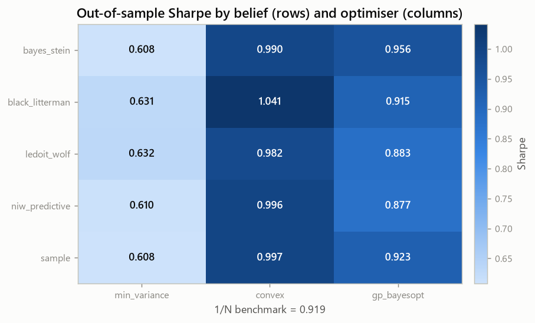

<h1 align="center">The Estimator or the Optimiser?</h1>

<p align="center">
  <strong>A walk-forward decomposition of Bayesian methods in mean–variance portfolio choice.</strong>
</p>

<p align="center">
  <a href="https://github.com/NekoTensor/Bayesian-portfolio-optimization/actions/workflows/tests.yml"></a>
  
  <a href="LICENSE">
  </a>
  
</p>

<p align="center">
  <a href="#quick-start">Quick start</a> ·
  <a href="#results">Results</a> ·
  <a href="#how-it-works">How it works</a> ·
  <a href="#using-the-library">Library</a> ·
  <a href="docs/methodology.md">Methodology</a> ·
  <a href="reports/">Paper</a>
</p>

---

Mean–variance portfolio selection needs two estimated inputs — a vector of expected
returns `μ` and a covariance matrix `Σ` — and an optimiser to turn them into weights.
Studies comparing portfolio methods routinely change the estimator, the optimiser,
and the constraint set all at once, then credit the whole difference to whichever
component the title names.

**This project separates them.**

> Holding the objective and the feasible set fixed, how much out-of-sample
> performance comes from the estimator, and how much from the optimiser?

Five belief-formation rules are crossed with three allocators over an identical
feasible set, evaluated by rolling-origin walk-forward against the 1/N benchmark,
with significance testing that accounts for having tried every cell.

<!-- HIGHLIGHTS:START -->
<!-- Generated by experiments/make_report_tables.py -- do not edit by hand. -->
| Finding | Evidence |
|---|---|
| **Convex optimisation beat Gaussian-process search on every estimator** | 5 of 5 paired comparisons; mean Sharpe 1.001 vs 0.911, at 1.4× the turnover |
| **No strategy separated from the 1/N benchmark** | 0 of 15 configurations significant at the 5% level |
| **The differences are smaller than the error bars** | median 95% interval 1.19 Sharpe units wide vs a 0.43 best-to-worst spread |

<sub>469 out-of-sample weeks, 2015-01-04 → 2023-12-24, net of 10 bps. Every number on this page is generated from <code>results/</code>.</sub>
<!-- HIGHLIGHTS:END -->

<p align="center">
  
  <br><sub>Columns move the result; rows barely do. That is the finding.</sub>
</p>

---

## Quick start

```bash
git clone https://github.com/NekoTensor/Bayesian-portfolio-optimization.git
cd Bayesian-portfolio-optimization
pip install -e ".[dev]"
```

```bash
python -m pytest                      # verify the harness, incl. the look-ahead test
python experiments/run_backtest.py    # reproduce every number in results/
```

The price panel is committed, so nothing downloads and results reproduce offline.
A full run takes ~35 minutes; the Gaussian-process arms dominate it. Add
`--gp-budget 15` to iterate in about two.

## The design

|  | minimum variance | convex (SLSQP) | GP Bayesian opt |
|:--|:--:|:--:|:--:|
| **Sample moments** | ✓ | ✓ | ✓ |
| **Ledoit–Wolf shrinkage** | ✓ | ✓ | ✓ |
| **Bayes–Stein** | ✓ | ✓ | ✓ |
| **NIW posterior predictive** | ✓ | ✓ | ✓ |
| **Black–Litterman** | ✓ | ✓ | ✓ |

Plus **1/N** as the benchmark — the baseline
[DeMiguel, Garlappi & Uppal (2009)](https://doi.org/10.1093/rfs/hhm075) showed is
hard to beat, and the one most portfolio studies quietly omit.

Rows vary how beliefs about `μ` and `Σ` are formed. Columns vary how weights are
searched for. Because both axes see the same objective, the same constraint set and
the same data, a difference along one of them is attributable to that axis alone.

<!-- RESULTS:START -->
<!-- Generated by experiments/make_report_tables.py -- do not edit by hand. -->
## Results

469 out-of-sample weeks (2015-01-04 → 2023-12-24),
7 assets, 156-week rolling training window,
rebalanced every 13 weeks, 10 bps proportional cost,
40% position cap. Every weight is chosen using only data strictly
preceding the period it is evaluated on.

| Strategy | Sharpe | 95% CI | Δ vs 1/N | *p* | Ann. return | Max DD | Turnover |
|---|---|---|---|---|---|---|---|
| Black–Litterman + Convex | 1.041 | [0.49, 1.66] | +0.123 | 0.52 | 17.72% | -29.70% | 0.66 |
| Sample + Convex | 0.997 | [0.42, 1.60] | +0.078 | 0.70 | 12.35% | -17.71% | 0.28 |
| NIW predictive + Convex | 0.996 | [0.42, 1.60] | +0.078 | 0.70 | 12.33% | -17.64% | 0.28 |
| Bayes–Stein + Convex | 0.990 | [0.41, 1.59] | +0.072 | 0.72 | 12.26% | -17.78% | 0.28 |
| Ledoit–Wolf + Convex | 0.982 | [0.41, 1.58] | +0.063 | 0.74 | 12.34% | -18.63% | 0.28 |
| Bayes–Stein + GP BayesOpt | 0.956 | [0.37, 1.58] | +0.038 | 0.84 | 13.10% | -21.01% | 0.37 |
| Sample + GP BayesOpt | 0.923 | [0.37, 1.49] | +0.004 | 0.98 | 12.95% | -16.80% | 0.42 |
| **1/N (benchmark)** | **0.919** | [0.36, 1.57] | — | — | 14.40% | -24.47% | 0.10 |
| Black–Litterman + GP BayesOpt | 0.915 | [0.36, 1.55] | -0.004 | 0.98 | 16.09% | -29.11% | 0.84 |
| Ledoit–Wolf + GP BayesOpt | 0.883 | [0.30, 1.49] | -0.036 | 0.86 | 12.55% | -23.77% | 0.39 |
| NIW predictive + GP BayesOpt | 0.877 | [0.30, 1.48] | -0.041 | 0.84 | 12.54% | -22.64% | 0.42 |
| Ledoit–Wolf + Min-var | 0.632 | [0.06, 1.26] | -0.287 | 0.09 | 6.45% | -17.25% | 0.13 |
| Black–Litterman + Min-var | 0.631 | [0.06, 1.26] | -0.288 | 0.09 | 6.44% | -17.29% | 0.13 |
| NIW predictive + Min-var | 0.610 | [0.05, 1.25] | -0.309 | 0.08 | 6.23% | -17.60% | 0.15 |
| Sample + Min-var | 0.608 | [0.05, 1.25] | -0.311 | 0.08 | 6.21% | -17.74% | 0.15 |
| Bayes–Stein + Min-var | 0.608 | [0.05, 1.25] | -0.311 | 0.08 | 6.21% | -17.74% | 0.15 |

*p* is the Ledoit–Wolf (2008) test for a difference in Sharpe ratios against 1/N,
robust to the autocorrelation and fat tails that invalidate the textbook
Jobson–Korkie statistic. Intervals are stationary-bootstrap percentiles.

### What the experiment found

**1. Bayesian optimisation lost to convex optimisation — on every estimator.**
Given the identical objective, the identical feasible set, and a search budget that
*favoured* it (60 GP evaluations against
15 SLSQP restarts), the Gaussian-process
allocator finished behind SLSQP in 5 of 5 paired
comparisons — mean Sharpe 0.911 against 1.001, a gap of
0.090. It also turned over
1.4×
as much portfolio per rebalance to get there.

This is the reverse of what the original version of this project reported, and the
reversal is diagnostic rather than surprising. Maximising the Sharpe ratio of a
plug-in `μ`/`Σ` is a *convex* problem that SLSQP solves essentially exactly. A
global black-box search cannot beat an exact solver on its own objective; it can
only fit the training window's noise more aggressively. In-sample that looks like
outperformance. Out-of-sample it is a cost.

**2. Nothing beat 1/N. Not one strategy of 15.**
The best configuration (Black–Litterman + Convex, Sharpe
1.041) sits +0.123
above the benchmark with *p* = 0.52 — it pays for
that edge with -29.7% maximum drawdown against 1/N's
-24.5%, and 6×
the turnover. 0 of 15 configurations beat equal-weighting at
the 5% level. This replicates [DeMiguel, Garlappi & Uppal (2009)](https://doi.org/10.1093/rfs/hhm075)
on an independent sample.

**3. The estimator axis was nearly flat here — and the error bars explain why.**
Across the convex allocators, swapping sample moments for Ledoit–Wolf, Bayes–Stein,
NIW, or Black–Litterman moved the Sharpe ratio by 0.060 in total.
The median 95% interval is 1.19 Sharpe units wide. With
469 weekly observations, *no* difference of the size this
literature typically reports is distinguishable from zero.

That is the finding with teeth, and it indicts the original claim directly: a
"35% Sharpe improvement" is roughly 0.27 of one
confidence-interval width. It was never a result. It was noise that had not been
measured.

Read this as a negative result on a small universe, not a general law: with
7 assets and a 156-week window,
`N/T` is small, which is exactly the regime where shrinkage has least to offer.
The design, not the verdict, is what transfers.

<p align="center">
  
  <br><em>Out-of-sample growth of $1. The spread between methods is smaller than the
  spread between plausible histories of any one of them.</em>
</p>

<p align="center">
  
  <br><em>Every interval contains every other point estimate. Overlap alone does not
  settle it — these series are highly correlated, so the paired difference test is
  what governs. Here it agrees.</em>
</p>
<!-- RESULTS:END -->

---

## How it works

A portfolio backtest chains four steps, and conflating any two is how misleading
results get produced. Each stage here is a pure function of the one before it:

```
price panel ──▶ belief ──▶ weights ──▶ realised returns ──▶ verdict
  data.py     estimators.py  strategies.py    backtest.py       stats.py
                             objectives.py                      stress.py
```

### Belief formation — the Bayesian half

Estimation error in `μ` and `Σ` is the binding constraint in mean–variance choice.
A Gaussian process over the *weight* space does nothing about it, which is why this
project treats "Bayesian optimisation" and "Bayesian statistics" as different axes
rather than synonyms.

| Estimator | What it does |
|---|---|
| **Ledoit–Wolf (2004)** | Analytically optimal shrinkage of `Σ` toward constant correlation. Tests verify the intensity decays as ~1/T and beats the sample covariance in ≥80% of short-window draws against known truth. |
| **Bayes–Stein (Jorion, 1986)** | Shrinks `μ` toward the global minimum-variance return and inflates `Σ` for the parameter uncertainty plug-in methods ignore. |
| **NIW posterior predictive** | Conjugate prior on `(μ, Σ)`; the allocator receives a multivariate-*t* predictive distribution, not a point estimate. |
| **Black–Litterman (1992)** | Equilibrium prior by reverse optimisation, blended with a cross-sectional momentum view. |

### Inference — why point estimates are not conclusions

| Method | Role |
|---|---|
| **Ledoit–Wolf (2008)** studentised bootstrap | Headline test. Robust to the fat tails and autocorrelation that invalidate the textbook Jobson–Korkie statistic. |
| **Memmel (2003)** | Closed-form Sharpe difference test, as a fast cross-check. |
| **Politis–Romano (1994)** stationary bootstrap | Confidence intervals that preserve serial dependence. |
| **Deflated Sharpe Ratio** (Bailey & López de Prado, 2014) | Corrects the winner for how many configurations were tried — counting **all** of them, including the losers. |

### Tail risk

`portfolio/stress.py` estimates portfolio-level VaR and CVaR three ways — Gaussian,
fitted Student-*t*, and stationary block bootstrap — and reports the spread between
them as a measure of model risk rather than collapsing it to one number.
`worst_historical_windows` reports the portfolio's worst realised stretches, which
need no calibration because they are facts about the data.

## Engineering guarantees

These are enforced mechanically, not asserted in prose:

| Guarantee | How it is enforced |
|---|---|
| **No look-ahead** | A test corrupts every return after a cutoff and asserts each weight decided before it is **bitwise** unchanged. |
| **Identical feasible sets** | One `FeasibleSet` object is passed to every allocator; each returned weight vector is checked against it. |
| **Equal search effort** | Both optimisers expose `search_budget`, so thoroughness is equalised rather than confounded with method. |
| **Honest multiple testing** | The Deflated Sharpe Ratio counts every configuration run, including those that lost. |
| **No transcribed numbers** | Every figure in this README and in the paper is generated from `results/`. CI fails if regenerating changes a committed file. |

## Using the library

```python
from portfolio.backtest import make_strategy, walk_forward
from portfolio.data import load_returns
from portfolio.estimators import ledoit_wolf
from portfolio.objectives import FeasibleSet
from portfolio.strategies import max_sharpe_convex

returns  = load_returns()
feasible = FeasibleSet(n_assets=returns.shape[1], max_weight=0.40)
strategy = make_strategy(ledoit_wolf, max_sharpe_convex, feasible)

result = walk_forward(returns, strategy, train_window=156, rebalance_every=13, cost_bps=10.0)
print(result.metrics())
```

Any callable `(train_returns) -> Belief` is an estimator and any
`(belief, feasible, prev_weights) -> weights` is an allocator, so adding a method
means writing one function and registering it.

```python
from portfolio.stress import compare_var_models, worst_historical_windows

weights = result.weights.iloc[-1].to_numpy()
print(compare_var_models(returns, weights, horizon=13, level=0.05))
print(worst_historical_windows(returns, weights, window=13, top_k=5))
```

## Repository layout

```
portfolio/          the library
├── data.py           load the committed price panel
├── objectives.py     FeasibleSet, simplex projection, Sharpe objective, turnover
├── estimators.py     training window -> Belief(mu, cov)
├── strategies.py     Belief + FeasibleSet -> weights
├── backtest.py       rolling-origin walk-forward with costs and weight drift
├── stats.py          Sharpe difference tests, bootstrap CIs, Deflated Sharpe
└── stress.py         portfolio-level VaR/CVaR: Gaussian vs Student-t vs bootstrap

experiments/        reproducible entry points -> results/
tests/              property and regression tests, incl. the look-ahead poison test
results/            committed outputs: metrics, significance, figures, config
docs/               methodology, postmortem, architecture, usage
reports/            the LaTeX paper (numbers auto-generated, built in CI)
legacy/             the March 2025 version, preserved
```

## Documentation

| | |
|---|---|
| [**Methodology**](docs/methodology.md) | Design, estimators, inference, threats to validity |
| [**Architecture**](docs/architecture.md) | How the modules compose |
| [**Usage**](docs/usage.md) | Installing, running, extending |
| [**Paper**](reports/) | The write-up; builds in CI, contains no hand-typed numbers |
| [**Postmortem**](docs/postmortem.md) | An invalid earlier result, and its correction |

## Limitations

Stated up front, because the previous version's limitations section listed generic
Gaussian-process caveats while omitting the flaw that actually invalidated it.

- **Universe.** Seven assets, not chosen by a stated prior rule. With `N=7` and
  `T=156` the ratio `N/T` is mild — precisely the regime where shrinkage estimators
  have *least* to offer, making this a weak test of them. A wider universe is the
  single most valuable extension.
- **One market path.** The out-of-sample window is dominated by a US equity bull
  market with two sharp drawdowns. It is one history, not a distribution over them.
- **Statistical power.** At this sample size only large Sharpe differences are
  detectable. A null result here is an absence of evidence, not evidence of equality.
- **Cost model.** Proportional costs only: no market impact, spread, or capacity
  constraint. Adequate at these turnover levels, not at higher frequencies.

Full discussion in [`docs/methodology.md`](docs/methodology.md#threats-to-validity).

## Provenance

An earlier version of this project (March 2025) reported that Bayesian optimisation
improved the Sharpe ratio by 35% and cut drawdown by 34%. **That result was
invalid**: weights were fitted on the full sample and evaluated on that same sample,
the two methods were given different feasible sets, and the notebook that produced
the published figures hardcoded its weights rather than calling an optimiser.

[`docs/postmortem.md`](docs/postmortem.md) is the full accounting — what the error
was, why it produced a positive result almost automatically, and what the honest
numbers turned out to be. The original code is preserved under [`legacy/`](legacy/)
so the postmortem can be checked against it.

## Citing

```bibtex
@software{kamble_estimator_or_optimiser,
  author = {Kamble, Amey},
  title  = {The Estimator or the Optimiser? A Walk-Forward Decomposition of
            Bayesian Methods in Mean--Variance Portfolio Choice},
  year   = {2026},
  url    = {https://github.com/NekoTensor/Bayesian-portfolio-optimization}
}
```

## License

[MIT](LICENSE) · NekoTensor · [nekotensor@gmail.com](mailto:nekotensor@gmail.com)
